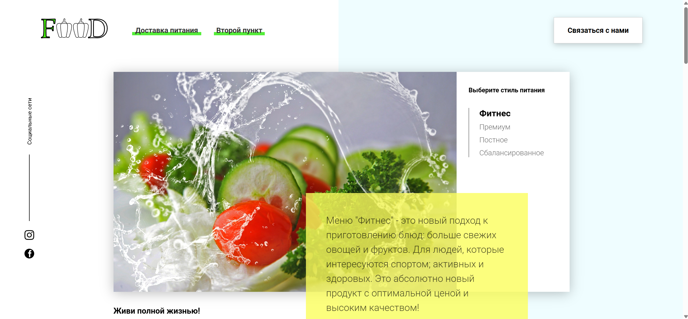

# 📘 Словарь на JavaScript

## 🚀 Используемые технологии


---


## ⚙️ Установка и запуск проекта

1. Склонируйте проект:
   ```bash
   git clone https://github.com/Alexander-Klem/Dictionary.git
2. Установите зависимости:
   ```bash
   npm install
3. Установите:
    * Node.js   
    * Open Server
4. Установить Webpack:
    - Инициализируйте проект:
    ```bash
    npm init -y    
5. Установите Webpack и Webpack CLI
    ```bash
    npm install --save-dev webpack webpack-cli
## 🧰 Настройка через Open Server

1. Переместите папку проекта в директорию home:
    ```bash 
    OSPanel/home/Food/
2. Запустите Open Server, включите модуль PHP 7.4.
3. Подключите в консоли сборщик webpack 
    ```bash
    npx webpack
4. Также подключите в консоли локальную базу данных
    ```bash
    npx json-server db.json
5. Откройте сайт через Openserver:
    ```bash 
    http://food/

